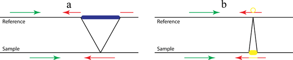
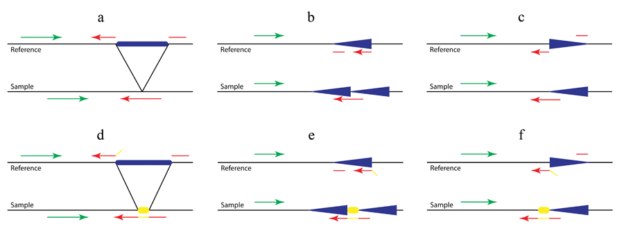

# User Manual

***

On this page, we describe how you can use Pindel. A very simple example with four reads that support a deletion event is used to go into more detail.

## General Workflow

_(Click for full-size image)_

###Step 1: Extract useful reads for Pindel from SAM/BAM files

####Option 1 and the best to try first: Indexed BAM files produced by BWA or MOSAIK on Illumina reads, via a configuration file

Pindel version 0.2.0 and above can directly read in BWA/MOSAIK-generated BAM-files. As a user, you do need to create a small text-file containing the names of the BAM-files you want to search for indels and structural variations. On each line, list the name of the bam-file, the insert size, and the label for the sample. For example, given two bam-files named 'tumor_sample_1222.bam' and 'somatic_sample_1222.bam' with insert-sizes ( the length of sequence between the paired-end adapters in paired-end sequence) of 250 bp, the configuration text file could look like

<pre class="scrollable terminal">
tumor_sample_1222.bam     250   TUMOR_1222
somatic_sample_1222.bam   250   HEALTHY_1222 
</pre>

When running pindel, use the -i option followed by the name of the config file (such as 'config_1222.txt')

####Option 2: Pindel format reads extracted using bam2pindel.pl from BAM files produced by BWA on Illumina read

Bam2pindel was written by Keiran Raine at the Sanger Institute. It has been designed for BAM files processed by BWA from Illumina data. Either name or coordinate sorted bam files can be used as input. 

As of Pindel version 0.2.0 and above, using bam2pindel.pl is no longer preferred, as the configuration file option makes Pindel run faster. However, it is still possible to use bam2pindel. If you choose this option, use the following steps:

1\. Download the BWA_BAM_2_PINDEL.tar.gz package from one of the following sources, and save it in a directory of your choice (say: '/user/pindel-0.2.0/'):
* [https://trac.nbic.nl/pindel/downloads](https://trac.nbic.nl/pindel/downloads)
* [http://www.ebi.ac.uk/~kye/pindel/v_0.2.0/BWA_BAM_2_PINDEL.tar.gz](http://www.ebi.ac.uk/~kye/pindel/v_0.2.0/BWA_BAM_2_PINDEL.tar.gz)
* [ftp://ftp.sanger.ac.uk/pub/zn1/pindel/Pindel_0.2.0.tar.gz](ftp://ftp.sanger.ac.uk/pub/zn1/pindel/Pindel_0.2.0.tar.gz)

BWA_BAM_2_PINDEL.tar.gz contains four files: 
1. bam2pindel.pl: perl script 
2. Adaptor.pm: perl module to configure the tool;
3. samgroupbyname: binary program to locate reads in a pair 
4. readme.txt: Written by Keiran to explain how to use the tool

2\. set BAM_2_PINDEL_ADAPT in the way that your shell prescribes (you can find your shell type with "echo $SHELL"):
csh:

    setenv BAM_2_PINDEL_ADAPT /user/pindel-0.2.0/Adaptor.pm

bash, ksh and sh:

    export BAM_2_PINDEL_ADAPT=/user/pindel-0.2.0/Adaptor.pm

3\. Run bam2pindel on the input file, for example ./bam2pindel.pl –i tumor_sample_1222.bam –o tumor_1222_pindelformat -s tumor_1222 –nm –pi 250

Arguments:
<pre class="terminal scrollable">
-i   input: Input BAM file (required parameter)
-o   output: First part of the name of your output file(s) (one file is created per chromosome, the files produced 
        will be start with the output prefix followed by '_', the chromosome name, and '.txt')
-s   sample: Sample or label (sampA,sampB...) (required parameter)
-pi  insert: Required if BAM file does not have PI tag in header RG record: the length of sequence between 
        the paired-end adapters in paired-end sequence
-r   restrict: Restrict to chromosome xx
-om  old method: use samtools to locate reads in a pair; BAM must be name sorted.
-nm  new method: use samgroupbyname to locate reads in a pair; BAM can be coordinate sorted.
</pre>

The output of bam2pindel.pl can later be used a input for pindel by preceding it with the -p option.

####Option 3: SAM/BAM-file not produced by BWA

If another aligner than BWA was used, the best way to convert the reads to pindel input format is to use sam2pindel.cpp. Sam2pindel expects a mapping location of mate read if the query is unmapped while the mate has been mapped. Users may need to fix the information about mate reads for some mappers such as bowtie. Compiling and running sam2pindel.cpp works as follows:

1\. Download the cpp code (SAM_2_PINDEL_cin_2010Dec2.cpp) from either of the following sources:
[https://trac.nbic.nl/pindel/downloads](https://trac.nbic.nl/pindel/downloads)
[http://www.ebi.ac.uk/~kye/pindel/v_0.2.0/SAM_2_PINDEL_cin_2010Dec2.cpp](http://www.ebi.ac.uk/~kye/pindel/v_0.2.0/SAM_2_PINDEL_cin_2010Dec2.cpp)
[ftp://ftp.sanger.ac.uk/pub/zn1/pindel/Pindel_0.2.0.tar.gz](ftp://ftp.sanger.ac.uk/pub/zn1/pindel/Pindel_0.2.0.tar.gz)

2\. compile the cpp source code:

    g++ SAM_2_PINDEL_cin_2010Dec2.cpp –o sam2pindel –O3

3\. run sam2pindel. If the input is a sam file, the command should look similar to this:

    ./sam2pindel input.sam Output4Pindel.txt 300 tumour 0

If the input is a bam-file, sam2pindel should be run like this:

    ./samtools view input.bam | ./sam2pindel - Output4Pindel.txt 300 tumour 0

Sam2pindel requires five arguments:

* Input sam file (here 'input.sam')
* Output for pindel (here 'Output4Pindel')
* insert size (here 300): the length of sequence between the paired-end adapters in paired-end sequence
* sample tag: (here 'tumor')
* number of extra lines (non-record and not starting with @) in the beginning of the file to skip (here 0).

### Step 2: Calling indels and structural variations with Pindel

#### Step 2.1: Installing Pindel
<pre class="scrollable terminal">git clone git://github.com/genome/pindel.git
cd pindel 
./INSTALL /path/to/samtools_FOLDER/
</pre>

link to [Install](install.html) page.

#### Step 2.2: Running Pindel

If you have a BWA-BAM-file and created a bam-configuration file as per option 1, run pindel with the -i option, so

    ./pindel -f hs_ref_GRCh37.fa -i 1222config.txt -c ALL -o sample_1222
    
If you have used option 2 or 3, first decide whether you want to create an output file that directly compares the indels and structural variations in two samples (for example, tumor versus normal), in that case, concatenate the files first (for example: "cat tumor_1222.txt somatic_1222.txt > totalsample_1222.txt").

Run pindel with the -p option followed by the name of the pindel input file, so

    ./pindel -f hs_ref_GRCh37.fa -p tumor_1222_chr1.txt -c ALL -o tumor_1222
    
The output files should then contain all detected indels and SVs relative to the reference, and the labels will indicate in which samples each indel and SV occurred.

Pindel has many parameters that you can set to increase speed (multithreading) or change the balance between sensitivity and specificity. The parameters are:

#####Required parameters

<pre class="terminal scrollable">
-f/--fasta               the reference genome sequences in fasta format
-p/--pindel-file         the Pindel input file; (either this or a bam configuration file is required).
-i/--config-file         the bam config file; either this or a pindel input file is required. Per line: path and file name of bam, insert 
                            size and sample tag. For example: /data/tumour.bam  400  tumour
-o/--output-prefix       Output prefix
-c/--chromosome          Which chr/fragment. Pindel will process reads for one chromosome each time. ChrName must be the same as in reference 
                            sequence and in read file. '-c ALL' will make Pindel loop 
                            over all chromosomes. The search for indels and SVs can also be limited to a specific region; 
                                -c 20:10,000,000 will only look for indels and SVs after position 10,000,000 == [10M, end], 
                                -c 20:5,000,000-15,000,000 will report indels in the range between and including the bases at 
                                  position 5,000,000 and 15,000,000 = [5M, 15M]	
</pre>

#####Parameters affecting runtime and memory usage

<pre class="terminal scrollable">
-T/--number_of_threads   the number of threads Pindel will use (default 1). More threads assures lower runtime, but requires 
                            multiple processors
-w/--window_size         for saving RAM, divides the reference in bins of X million bases and only analyzes the reads per bin 
                            (default 10 (=10 million)). A smaller bin size will reduce memory but will increase runtime slightly.
</pre>

#####Parameters affecting which structural variants are reported

<pre class="terminal scrollable">
-x/--max_range_index             the maximum size of structural variations to be detected; the higher this number, the greater the 
                                    number of SVs reported, but the computational cost and memory requirements increase, as does the 
                                    rate of false positives. 1=128, 2=512, 3=2,048, 4=8,092, 5=32,368, 6=129,472, 7=517,888, 8=2,071,552, 
                                    9=8,286,208 (maximum 9, default 5)
-r/--report_inversions           report inversions (default true)
-t/--report_duplications         report tandem duplications (default true)
-l/--report_long_insertions      report insertions of which the full sequence cannot be deduced because of their length (default true)
-k/--report_breakpoints          report breakpoints (default true)
-s/--report_close_mapped_reads   report reads of which only one end (the one closest to the mapped read of the paired-end read) could 
                                    be mapped (default false)
-n/--min_NT_size                 only report inserted (NT) sequences in deletions greater than this size (default 50)
-v/--min_inversion_size          only report inversions greater than this number of bases (default 50)
</pre>

#####Parameters affecting sensitivity and selectivity

<pre class="terminal scrollable">
-d/--min_num_matched_bases           only consider reads as evidence if they map with more than this number of bases to the reference (default 30)
-a/--additional_mismatch             Pindel will only map part of a read to the reference genome if there are no other candidate positions 
                                        with no more than the specified number of mismatches position. The bigger this value, the more accurate 
                                        but less sensitive. (default value 1)
-m/--min_perfect_match_around_BP     at the point where the read is split into two, there should at least be this number of perfectly matching bases 
                                        between read and reference (default value 3)
-e/--sequencing_error_rate           the expected fraction of sequencing errors (default 0.05)
-u/--maximum_allowed_mismatch_rate   only reads with fewer mismatches with the reference genome than this fraction will be considered (default 0.1)
</pre>

#####Miscellaneous parameters
<pre class="terminal scrollable">
-b/--breakdancer         [file name]. Pindel is able to use calls from other SV methods such as BreakDancer to further increase sensitivity and specificity.  
                            BreakDancer result or calls from any methods must in the format:   ChrA LocA stringA ChrB LocB stringB other
-Q                       [file name] The list of BreakDancer calls with Pindel support information. 
                            Format: chr   Loc_left   Loc_right   size   type   index
                            For example, "1	72766323 	72811840 	45516	D	11970" means the deletion event chr1:72766323-72811840 of size 45516 is 
                            reported as an event with index 11970 in Pindel report of deletion. 
-h/--help                show the command line options of Pindel
</pre>

Example reads in the input read file

In case someone needs to write software to convert read alignments from an unsupported mapper to the Pindel input file format, example reads are provided below and requirements are explained.

The empty lines between the reads are normally not present and are added here for clarification only. 

<pre class="scrollable">
@HWI-EAS255_8291_FC30GRN_PE:3:61:366:1255/2
CTGAAACTTGAGTTTTTTTTTTCTTTTTAATCACCATCACAGTGAAGGATACGTTGTAGGTGGTGCCCTACTCTT
+       20      10023140        60      200     COLO-829-BL

@HWI-EAS255_8291_FC30GRN_PE:8:46:1445:570/1
ATAACATAAATCTGAAACTTGAGTTTTTTTTTTCTTTTTAATCACCATCACAGTGAAGGATACGTTGTAGGTGGT
+       20      10023153        60      200     COLO-829-BL 

@HWI-EAS255_8282_FC30G79_PE:3:19:49:1471/2
AAAAGAAAAAAAGATGTTTTGACTAAAATAACATAAATCTGAAACTTGAGTTTTTTTTTTCTTTTTAATCACCAT
+       20      10023357        60      200     COLO-829-BL

@HWI-EAS107_8284_FC30GCE_PE:4:28:1631:87/1
GTGATGGTGATTAAAAAGAAAAAAAAAACTCAAGTTTCAGATTTATGGTATTTTAGTCAAAACATCTTTTTGTCT 
-       20      10023849        60      200     COLO-829-BL 
</pre>
###How to prepare a correct Pindel input file by yourself

Read name must start with <code>‘@’</code>.

The second line is the sequence of the unmappable read. Currently Pindel is designed for SLX/Illumina reads so that the two reads in a pair are expected to be on different strands. If you are not sure whether to convert unmappable reads obtained from a bam file to its reverse complementary, please make sure that it is the same as in the original SLX/Illumina fastq file before mapping.

The third line contains

* Mapping strand of the MAPPED read. "+" means forward while "-" means reverse;
* Chromosome name; please keep the name consistent as in the reference sequence.
* The 3' end coordinate of mapped read in the chromosome;
* Mapping quality of the mapped read;
* Insert size. A rough estimation is fine.
* A tag to indicate sample source. Please don’t put read name here but just limited categories (&lt;1000) such as normal, tumor or sample name if you pool reads from several samples.

##Example output record

###Simple deletion and insertion

If you do not wish to understand the Pindel raw output format, please first convert the result to VCF and perform downstream analysis; If you care more about the high quality variants and want to do filtering by yourselves, you may grep the head lines (grep ChrID, for example) and design your filtering conditions based on the information provided. It is tricky to understand the read alignment to the modified reference genome. Here are some useful tips:

1. We display the original reads without any modification but place them at correct positions. 
2. The reference is modified in a way to match the reads, for visualization and debug purposes.
3. If there are two breakpoints with different sequence content (for example, read alignment to the left and to the right breakpoints of an inversion or an large insertion), there are two sections of read alignment for each breakpoint. 

 
Figure 1. A pattern growth approach, as implemented in Pindel, to detect simple deletions (a) and insertions (b) at nucleotide-resolution. In the preprocessing step, all reads are mapped to the reference genome. Then the mapping results are examined to select those paired reads that mapped with indels or of which only one end can be mapped. Pindel uses the mapped read to determine the anchor point on the reference genome and the direction of the unmapped read (or of the mapped read with indels). Knowing the anchor point and the user-defined maximum deletion size, a sub-region in the reference genome can be located, in which Pindel will try to map both ends of the unmapped read separately.

<pre class="scrollable terminal">
  ####################################################################################################
  244     D 1671  NT 0 "" ChrID 20        BP 1337143      1338815 BP_range 1337143        1338818 Supports 10     10      + 6     6       - 4     4       S1 35   SUM_MS 322      2       NumSupSamples 2 2       COLO-829 3 3 0 0        COLO-829-BL 3 3 4 4
  GTGGTTAAGCCTTGCCCTGTAGCCTAGGTAAAAATGTGCAAGGTTGTCAGGGCACCAGCATGGAGGAGTTCCCCTacaaa&lt;1661&gt;tcagaACAGTCTTTCCAATACCTATGTGGTCTCTGGAACAGACATTTCATCCAGTAGCCATTCC
                                  AATGTGCAAGGTTGTCAGGGCACCAGCATGGAGGAGTTCCCCT                ACAGTCTTTCCAATACCTATGTGGTCTCTGGA                                             +       1336638 37      COLO-829        @EAS188_62:3:72:801:1263/2
                                            GTTGTCAGGGCACCATCATGGAGGAGTTCCCCT                ACAGTCTTTCCAATACCTATGTGGTCTCTGGAACAGACATTT                                   +       1336754 37      COLO-829        @EAS131_8:6:96:1531:1189/2
                                                     GCATCAGCATGGAGGAGTTCCCCT                ACAGTCTTTCCAATACCTATGTGGTCTCTGGAACAGACATTTCATCCAGTA                          +       1336784 37      COLO-829        @EAS56_118:1:70:1634:1121/1
                         CTAGGAAAAAATGTGCAAGGTTGTCAGGGCACCAGCATGGAGGAGTTCCCCT                ACAGTCTTTCCAATACCTATGTG                                                      +       1336766 25      COLO-829-BL     @USI-EAS39_8289_FC30GCV_PE:2:34:450:461/2
                                                       ACCAGCATGGAGAAGTTCCCCT                ACAGTCTTTCCAATACCTATGCGGTCTCTGGAACAGACATTTCATCCAGTACC                        -       1339193 25      COLO-829-BL     @HWUSI-EAS493_8289_FC30GNW_PE:1:100:1054:1860/1
                                           GGTTGTCAGGGCACCAGCATGGAGGAGTTCCCCT                ACAGTCTTTCCAATAACTATGTGGTCTCTGGAACAGACATT                                    -       1339198 37      COLO-829-BL     @HWI-EAS255_8291_FC30GRN_PE:3:62:514:1265/1
                                      TGCAAGGTTGTCAGGGCACCAGCATGGAGGAGTTCCCCT                ACAGTCTTTCCAATACTTATGTGGTCTCTGGAACAG                                         -       1339117 25      COLO-829-BL     @HWI-EAS138_4_FC30GP8:8:25:1623:1948/1
                                                           GCATGGAGGAGTTCCCCT                ACAGTCTTTACAATACCTATGTGGTCTCTGGAACAGACATTTCATCAAGTAGCCATT                    -       1339178 25      COLO-829-BL     @HWI-EAS138_4_FC30GP8:5:33:1309:281/1
                               AAAAATGTGCAAGGTTGTCAGGGCACCAGCATGGAGGAGTTCCCCT                ACAGTCTTTCCAATACCTATGTGGTCTCT                                                +       1336657 37      COLO-829-BL     @HWI-EAS138_4_FC30GP8:2:78:1354:119/2
                                                TCAGGTTACCAGCATGGAGGAGTTCCCCT                ACAGTCTTTCCAATTCCTATGTGGTCTCTGGAACAGACATTTCATC                               +       1336797 37      COLO-829-BL     @HWI-EAS107_8284_FC30GCE_PE:3:93:720:676/1

  ####################################################################################################
  57      I 10    NT 10 "ACTTGTTCCC"      ChrID 20        BP 400747       400748  BP_range 400742 400749  Supports 3      2       + 0     0       - 3     2       S1 4    SUM_MS 111      2       NumSupSamples 2 2       COLO-829 0 0 2 1        COLO-829-BL 0 0 1 1
  CCTAACTAAAGCCCATAACGTTAAAGATGTTACTGAGACCCATTGCCCTTGCTCATGATGTTAAAATTTCTTCCC          AGAGCTCTACGTCTAGTGTACCTTCTTCCGAGAGCCATGGGTTATGGGAAACAACAGTTTGCATTAGGTCCCATA
                                                                   ATTTCTCCCCACTTGTTCCCAGAGCTCTACGTCTAGTGTACCTTCTTCCGAGAGCCATGGGTTATGGGAAACAAC            -       400918  37      COLO-829        @EAS192_63:1:34:1066:302/1
                                                                   ATTTCTCCCCACTTGTTCCCAGAGCTCTACGTCTAGTGTACCTTCTTCCGAGAGCCATGGGTTATGGGAAACAAC            -       400938  37      COLO-829        @EAS131_6:3:83:1034:1777/1
                             TGTTACTGAGACCCATTGCCCTTGCTCATGATGTTAAAATTTCTCCCCACTTGTCCCCAGAGCTCTACGTCTACT                                                  -       401070  37      COLO-829-BL     @HWIEAS138_4_FC30GP8:8:32:378:1342/2     
  ####################################################################################################
  9       INV 3021        NT 0:0 "":""    ChrID 20        BP 43308894     43311910        BP_range 43308894       43311910        Supports 21     20      + 0     0       - 21    20      S1 22   SUM_MS 625      1       NumSupSamples 1 1       LUMC-A 8 47 0 0 21 20
  ATGGGGTCTTTTTTTTTTTCTTTTGAGACAGGGTCTCCTTCTCTTGCCCAGGCTGGAGTGCAACAGTGCAATCACAGCTCACTGCAGCCTCGAACTCCAGgtaaatctgttacattgtaattagcttttttcttctgatcacaaatgcaatgcattaattggtttgaatattttgagtgccctacagcaggtcaacccct
  ----------------------------------------------------------------------------------------------------
  aacccatctctacaaacaattttttaaaaatttgctgggcatggcggtgcactgtggtcccagctacttgggaggctgagcagggagggtcatgtgagccCTGATGCAAAGCAACGCAAGCATGGCCATCCCTCTGCATATATGGAAGCTTTTCCTTTTGGGGGAAACAGCAATATTTCCATTTTACGGAAAAAGAAATG
                                                                                         GTGAGCCCTGATGCAAAGCAACGCAAGCATGGCCATCCCTCTGCATATATGGAAGCTTTTCCTTTTGGGGGAAACAGCAATATTTCCATTTTACGGAAAA             -       43312695        29      LUMC-A  @GAIIX-593_0004:7:32:13561:20468/2
                                                                                      GGTCATGTGAGCCCTGATGCAAAGCAACGCAAGCATGGCCATCCCTCTGCATATATGGAAGCTTTTCCTTTTGGGGGAAACAGCAATATTTCCATTTTAC        -       43309627        37      LUMC-A  @GAIIX-593_0004:4:60:1309:10892/2
                                                                                   GAGGGTCATGTGAGCCCTGATGCAAAGCAACGCAAGCATGGCCATCCCTCTGCATATATGGAAGCTTTTCCTTTTGGGGGAAACAGCAATATTTCCATTT                   -       43312696        29      LUMC-A  @GAIIX-601_0003:6:69:1256:11097/2
                                                                               CAGGGAGGGTCATGTGAGCCCTGATGCAAAGCAACGCAAGCATGGCCATCCCTCTGCATATATGGAAGCTTTTCCTTTTGGGGGAAACAGCAATATTTCC                       -       43312692        29      LUMC-A  @GAIIX-601_0003:4:87:9700:9637/2
                                                                              GCAGGGAGGGTCATGTGAGCCCTGATGCAAAGCAACGCAAGCATGGCCATCCCTCTGCATATATGGAAGCTTTTCCTTTTGGGGGAAACAGCAATATTTC        -       43309629        29      LUMC-A  @GAIIX-593_0004:6:26:3360:12788/2
                                                                             AGCAGGGAGGGTCATGTGAGCCCTGATGCAAAGCAACGCAAGCATGGCCATCCCTCTGCATATATGGAAGCTTTTCCTTTTGGGGGAAACAGCAATATTT -       43309618        29      LUMC-A  @GAIIX-601_0003:7:120:15208:8175/2
                                                                         GCTGAGCAGGGAGGGTCATGTGAGCCCTGATGCAAAGCAACGCAAGCATGGCCATCCCTCTGCATATATGGAAGCTTTTCCTTTTGGGGGAAACAGCAAT                             -       43312699        29      LUMC-A  @GAIIX-789_0007:5:86:14923:17585/2
                                                                        GGCTGAGCAGGGAGGGTCATGTGAGCCCTGATGCAAAGCAACGCAAGCATGGCCATCCCTCTGCATATATGGAAGCTTTTCCTTTTGGGGGAAACAGCAA                              -       43312687        29      LUMC-A  @GAIIX-593_0004:6:21:14330:5739/1
                                                            AGCTACTTGGGAGGCTGAGCAGGGAGGGTCATGTGAGCCCTGATGCAAAGCAACGCAAGCATGGCCATCCCTCTGCATATATGGAAGCTTTTCCTTTTGG                                          -       43312676        29      LUMC-A  @GAIIX-789_0007:3:102:3390:7013/1
                                                      GGTCCCAGCTACTTGGGAGGCTGAGCAGGGAGGGTCATGTGAGCCCTGATGCAAAGCAACGCAAGCATGGCCATCCCTCTGCATATATAGAAGCTTTTCC                                                -       43312664        29      LUMC-A  @GAIIX-789_0007:1:119:15847:21047/1
                                             GTGCACTGTGGTCCCAGCTACTTGGGAGGCTGAGCAGGGAGGGTCATGTGAGCCCTGATGCAAAGCAACGCAAGCATGGCCATCCCTCTGCATATATGGA                                                         -       43312667        29      LUMC-A  @GAIIX-601_0003:6:63:15333:8800/1
                                         GGCGGTGCACTGTGGTCCCAGCTACTTGGGAGGCTGAGCAGGGAGGGTCATGTGAGCCCTGATGCAAAGCAACGCAAGCATGGCCATCCCTCTGCATATA     -       43309658        29      LUMC-A  @GAIIX-593_0004:3:104:9627:2222/1
                                       ATGGCGGTGCACTGTGGTCCCAGCTACTTGGGAGGCTGAGCAGGGAGGGTCATGTGAGCCCTGATGCAAAGCAACGCAAGCATGGCCATCCCTCTGCATA       -       43309659        29      LUMC-A  @GAIIX-593_0004:4:88:17216:14724/2
                                GCTGGGCATGGCGGTGCACTGTGGTCCCAGCTACTTGGGAGGCTGAGCAGGGAGGGTCATGTGAGCCCTGATGCAAAGCAACGCAAGCATGGCCATCCCT                                                                      -       43312640        29      LUMC-A  @GAIIX-593_0004:5:16:10088:19707/2
                             TTTGCTGGGCATGGCGGTGCACTGTGGTCCCAGCTACTTGGGAGGCTGAGCAGGGAGGGTCATGTGAGCCCTCATGCAAAGCAACGCAAGCATGGCCATC -       43309677        29      LUMC-A  @GAIIX-789_0007:1:45:11624:8214/2
                             TTTGCTGGGCATGGCGGTGCACTGTGGTCCCAGCTACTTGAGAGGCTGAGCAGGGAGGGTCATGTGAGCCCTGATGCAAAGCAACGCAAGCATGGCCATC -       43309674        29      LUMC-A  @GAIIX-593_0004:1:73:7763:14621/1
                            ATTTGCTGGGCATGGCGGTGCACTGTGGTCCCAGCTACTTGGGAGGCTGAGCAGGGAGGGTCATGTGAGCCCTGATGCAAAGCAACGCAAGCATGGCCAT                                                                          -       43312658        29      LUMC-A  @GAIIX-789_0007:2:108:4341:17887/1
                   TTTTTAAAAATTTGCTGGGCATGGCGGTGCACTGTGGTCCCAGCTACTTGGGAGGCTGAGCAGGGAGGGTCATGTGAGCCCTGATGCAAAGCAACGCAAG                                                                                   -       43312635        29      LUMC-A  @GAIIX-789_0007:1:33:10545:3120/2
                  TTTTTTAAAAATTTGCTGGGCATGGCGGTGCACTGTGGTCCCAGCTACTTGGGAGGCTGAGCAGGGAGGGTCATGTGAGCCCTGATGCAAAGCAACGCAA                                                                                    -       43312649        29      LUMC-A  @GAIIX-789_0007:2:60:12867:4172/1
              ACAATTTTTTAAAAATTTGCTGGGCATGGCGGTGCACTGTGGTCCCAGCTACTTGGGAGGCTGAGCAGGGAGGGTCATGTGAGCCCTGATGCAAAGCAAC                                                                                        -       43312639        37      LUMC-A  @GAIIX-789_0007:8:90:4523:15861/1
             AACAATTTTTTAAAAATTTGCTGGGCATGGCGGTGCACTGTGGTCCCAGCTACTTGGGAGGCTGAGCAGGGAGGGTCATGTGAGCCCTGATGCAAAGCAA -       43309687        29      LUMC-A  @GAIIX-789_0007:2:15:3988:4376/1
  ####################################################################################################
  10      INV 3   NT 3 "CCC"      ChrID 20        BP 46842550     46842554        BP_range 46842550       46842554        Supports 12     11      + 11    10      - 1     1       S1 24   SUM_MS 720      1       NumSupSamples 1 1       LUMC-A 0 0 11 10 1 1
  TCTCCTTTCTGCAGGGCCAGGGCCAGGCCCTCAGCAAGGCTGCTGGGGAGTCTTGGGGACAGAGCTGCTGCCCTGGCTGGGGTGGCCTTGCAGGAGGGGCcccGCCTGCTGTCCTTCCTGGGTAGGCTGAGTCTTGCTCTGTCCTGGCCAGTTTTAATAGCCTGAGGGCAGAGGGGAGGCAAAGGTGAACTCTAATGAGCCAT
                                                                                      GCCTTGCAGGAGGGGCCCCGCCTGCTCTCCTTCCTGGGTAGGCTGAGTCTTGCTCTGTCCTGGCCAGTTTTAATAGCCTGAGGGCAGAGGGGAGGCAAAG                +       46841831        60      LUMC-A  @GAIIX-601_0003:6:16:16375:10313/1
                                                                                     GGCCTTGCAGGAGGGGCCCCGCCTGCTCTCCTTCCTGGGTAGGCTGAGTCTTGCTCTGTCCTGGCCAGTTTTAATAGCCTGAGGGCAGAGGGGAGGCAAA         +       46841829        60      LUMC-A  @GAIIX-789_0007:7:102:15395:9546/1
                                                                             GCTGGGGTGGCCTTGCAGGAGGGGCCCCGCCTGCTCTCCTTCCTGGGTAGGCTGAGTCTTGCTCTGTCCTGGCCAGTTTTAATAGCCTGAGGGCAGAGGG         +       46841824        60      LUMC-A  @GAIIX-601_0003:6:78:9047:13796/1
                                                                      TGCCCTGGCTGGGGTGGCCTTGCAGGAGGGGCCCCGCCTGCTCTCCTTCCTGGGTAGGCTGAGTCTTGCTCTGTCCTGGCCAGTTTTAATAGCCTGAGGG                -       46843327        60      LUMC-A  @GAIIX-601_0003:7:102:11093:4080/1
                                                                  CTGCTGCCCTGGCTGGGGTGGCCTTGCAGGAGGGGCCCCGCCTGCTCTCCTTCCTGGGTAGGCTGAGTCTTGCTCTGTCCTGGCCAGTTTTAATAGCCTG            +       46841816        60      LUMC-A  @GAIIX-601_0003:8:5:9112:7988/1
                                                           GACAGAGCTGCTGCCCTGGCTGGGGTGGCCTTGCAGGAGGGGCCCCGCCTGCTCTCCTTCCTGGGTAGGCTGAGTCTTGCTCTGTCCTGGCCAGTTTTAA           +       46841802        60      LUMC-A  @GAIIX-601_0003:3:41:13393:14266/1
                                                        GGGGACAGAGCTGCTGCCCTGGCTGGGGTGGCCTTGCAGGAGGGGCCCCGCCTGCTCTCCTTCCTGGGTAGGCTGAGTCTTGCTCTGTCCTGGCCAGTTT              +       46841791        60      LUMC-A  @GAIIX-789_0007:1:85:8333:15538/2
                                          TGCTGGGGAGTCTTGGGGACAGAGCTGCTGCCCTGGCTGGGGTGGCCTTGCAGGAGGGGCCCCGCCTGCTCTCCTTCCTGGGTAGGCTGAGTCTTGCTCT            +       46841776        60      LUMC-A  @GAIIX-601_0003:7:4:8373:11960/2
                                        GCTGCTGGGGAGTCTTGGGGACAGAGCTGCTGCCCTGGCTGGGGTGGCCTTGCAGGAGGGGCCCCGCCTGCTCTCCTTCCTGGGTAGGCTGAGTCTTGCT              +       46841786        60      LUMC-A  @GAIIX-789_0007:6:24:6036:4236/2
                                      AGGCTGCTGGGGAGTCTTGGGGACAGAGCTGCTGCCCTGGCTGGGGTGGCCTTGCAGGAGGGGCCCCGCCTGCTCTCCTTCCTGGGTAGGCTGAGTCTTG                +       46841775        60      LUMC-A  @GAIIX-601_0003:8:79:9488:17765/1
                                      AGGCTGCTGGGGAGTCTTGGGGACAGAGCTGCTGCCCTGGCTGGGGTGGCCTTGCAGGAGGGGCCCCGCCTGCTCTCCTTCCTGGGTAGGCTGAGTCTTG                +       46841772        60      LUMC-A  @GAIIX-593_0004:5:2:11582:6890/1
                                    CAAGGCTGCTGGGGAGTCTTGGGGACAGAGCTGCTGCCCTGGCTGGGGTGGCCTTGCAGGAGGGGCCCCGCCTGCTCTCCTTCCTGGGTAGGCTGAGTCT          +       46841761        60      LUMC-A  @GAIIX-593_0004:7:91:10412:6533/1
  ####################################################################################################
  8       TD 80   NT 0 "" ChrID 20        BP 12453699     12453780        BP_range 12453699       12453780        Supports 14     14      + 7     7       - 7     7       S1 64   SUM_MS 406      1       NumSupSamples 1 1       LUMC-A 27 33 7 7 7 7
  GATATTCCTATTGTTACCCACTTATTTTTTATTCAACAATTTATTTATATCAATATGGACTCCTCTATGTGATACTGTAAGCAGATCTTATACTTTTGGTcttattttttattcaacaatttatttatatcaatatggactcctctatgtgatactgtaagcagatcttatacttttggttataatcgaataccacttat
                                                                                    AGATCTTATACTTTTGGTTATATTTTTTATTCAACAATTTATTTATATCAATATGGACTCCTCTATGTGATACTGTAAGCAGATCTTATACTTTTGGTTA
                                                                                 AGCAGATCTTATACTTTTGGTTATATTTTTTATTCAACAATTTATTTATATCAATATGGACTCCTCTATGTGATACTGTAAGCAGATCTTATACTTTTGG
                                                                            CTGTAAGCAGATCTTATACTTTTGGTTATATTTTTTATTCAACAATTTATTTATATCAATATGGACTCCTCTATGTGATACTGTAAGCAGATCTTATACT
                                                                      GTGATACTGTAAGCAGATCTTATACTTTTGGTTATATTTTTTATTCAACAATTTATTTATATCAATATGGACTCCTCTATGTGATACTGTAAGCAGATCT
                                                              TCCTCTATGTGATACTGTAAGCAGATCTTATACTTTTGGTTATATTTTTTATTCAACAATTTATTTATATCAATATGGACTCCTCTATGTGATACTGTAA
                                                            ACTCCTCTATGTGATACTGTAAGCAGATCTTATACTTTTGGTTATATTTTTTATTCAACAATTTATTTATATCAATATGGACTCCTCTATGTGATACTGT
                                                          GGACTCCTCTATGTGATACTGTAAGCAGATCTTATACTTATGGTTATATTTTTTATTCAACAATTTATTTATATCAATATGGACTCCTCTATGTGATACT
                                                          GGACTCCTCTATGTGATACTGTAAGCAGATCTTATACTTTTGGTTATATTTTTTATTCAACAATTTATTTATATCAATATGGACTCCTCTATGTGATACT
                                                       TATGGACTCCTCTATGTGATACTGTAAGCAGATCTTATACTTTTGGTTATATTTTTTATTCAACAATTTATTTATATCAATATGGACTCCTCTATGTGAT
                                                 TATCAATATGGACTCCTCTATGTGATACTGTAAGCAGATCTTATACTTTTGGTTATATTTTTTATTCAACAATTTATTTATATCAATATGGACTCCTCTA
                                              TTATATCAATATGGACTCCTCTATGTGATACTGTAAGCAGATCTTATACTTTTGGTTATATTTTTTATTCAACAATTTATTTATATCAATATGGACTCCT
                                         TTTATTTATATCAATATGGACTCCTCTATGTGATACTGTAAGCAGATCTTATACTTTTGGTTATATTTTTTATTCAACAATTTATTTATATCAATATGGA
                                    AACAATTTATTTATATCAATATGGACTCCTCTATGTGATACTGTAAGCAGATCTTATACTTTTGGTTATATTTTTTATTCAACAATTTATTTATATCAAT
                                ATTCAACAATTTATGTATATCAATATGGACTCCTCTATGTGATACTGTAAGCAGATCTTATACTTTTGGTTATATTTTTTATTCAACAATTTATTTATAT
</pre>

There is a head line for each variant reported, followed by the alignment of supporting reads to the reference on the second line.
The example variants are a 1671bp deletion and a 10bp insertion on chr20. The breakpoints are specified after “BP”. Due to microhomology around the breakpoints, the breakpoint coordinates may shift both upstream and downstream,'BP_range' is used to indicate the range of this shift.
The header line contains the following data:

1) The index of the indel/SV (57 means that 57 insertions precede this insertion in the file)

2) The type of indel/SV: I for insertion, D for deletion, INV for inversion, TD for tandem duplication

3) The length of the SV

4) "NT" (to indicate that the next number is the length of non-template sequences inserted; insertions are fully covered by the NT-fields, deletions can have NT bases if the deletion is not 'pure', meaning that while bases have been deleted, some bases have been inserted between the breakpoints)

5) the length(s) of the NT fragment(s)

6) the sequence(s) of the NT fragment(s)

7-8) the identifier of the chromosome the read was found on

9-10-11) BP: the start and end positions of the SV 

12-13-14) BP_range: if the exact position of the SV is unclear since bases at the edge of one read-half could equally well be appended to the other read-half. In the deletion example, ACA could be on any side of the gap, so the original deletion could have been between 1337143 and 1338815, between 1337144 and 1338816, or between 1337145 and 133817, or between 1337146 and 133818. BP-range is used to indicate this range.

15) "Supports": announces that the total count of reads supporting the SV follow.

16) The number of reads supporting the SV

17) The number of unique reads supporting the SV (so not counting duplicate reads)

18) +: supports from reads whose anchors are upstream of the SV

19-20) total number of supporting reads and unique number of supporting reads whose anchors are upstream of the SV.

21) -: supports from reads whose anchors are downstream of the SV

22-23) total number of supporting reads and unique number of supporting reads whose anchors are downstream of the SV

24-25) S1: a simple score, (“# +” + 1)* (“# -” + 1) ;

26-27) SUM_MS: sum of mapping qualities of anchor reads, The reads with variants or unmapped are called split-read, whose mate is called anchor reads. We use anchor reads to narrow down the search space to speed up and increase sensitivity;

28) the number of different samples scanned

29-30-31) NumSupSamples?: the number of samples supporting the SV, as well as the number of samples having unique reads supporting the SV (in practice, these numbers are the same)

32+) Per sample: the sample name, followed by the total number of supporting reads whose anchors are upstream, the total number of unique supporting reads whose anchors are upstream, the total number of supporting reads whose anchors are downstream, and finally the total number of unique supporting reads whose anchors are downstream. 

The second line shows the reference.

The third line and further show the sequence of the read, whether the anchor read is upstream(+) or downstream(-), the position of the mapped half of the paired-end read, the mapping quality of the mapped read, the sample name, and the read identifier.

If there are two breakpoints with potentially different read alignments as in INV and LI, there are two sections of read alignment showing each breakpoint with "-----" to separate them. The original read sequences (converted to plus strand, if necessary) and the modified reference genome are displayed in a way that you are examining the alignment not against the reference genome but to the sample genome as shown in Figure 2.

_(click for full-size image)_

Figure 2. Detection of complex structural variants (a. large deletions; b. tandem duplications; c. inversions) with (d, e and f) or without (a, b and c) non-template sequence. As shown in Figure 2b and 2c, in addition to the previously established Pindel method for the detection of deletions (Figure 1a and Figure 2a), we use the pattern growth and split-read approach to identify tandem duplications and inversions by carefully examining mapping locations, strands and directions of the two fragments of the unmapped end. For example, if one unmapped read is across the 5’ breakpoint of an inversion as shown in Figure 2c (red arrow in ‘sample’), the 3’ end of the unmapped read will be mapped to the reference normally related to the mapped read (green in ‘reference’) while the 5’ end will be aligned downstream of that and on the opposite strand (broken red arrow in ‘reference’). Thanks to the pattern growth and split-read algorithms we will be able to capture the non-template sequence (yellow in Fig 2d-f) inserted during double-strand break repair. Thus in Figure 2e the unmapped read (red and yellow in ‘sample’) will be split into three fragments, the yellow sequence being the inserted non-template sequence.

####Variant types reported by Pindel

*D = deletion*

*SI = short insertion*

*INV = inversion*

*TD = tandem duplication*

*LI = large insertion*

*BP = unassigned breakpoints*

The reported larger insertion (LI) record is rather different than other types of variants. Here is the format:
index, type(LI), ChrID, chrName, left breakpoint, number of supporting reads for the left coordinate, right breakpoint, number of supporting reads for the right coordinate.

For example:

    190 LI ChrID chr1 1000002 5 1000000 6 
    
As there may be sequence similarity around the breakpoint, we may see that the right coordinate may be smaller than the left one. 
